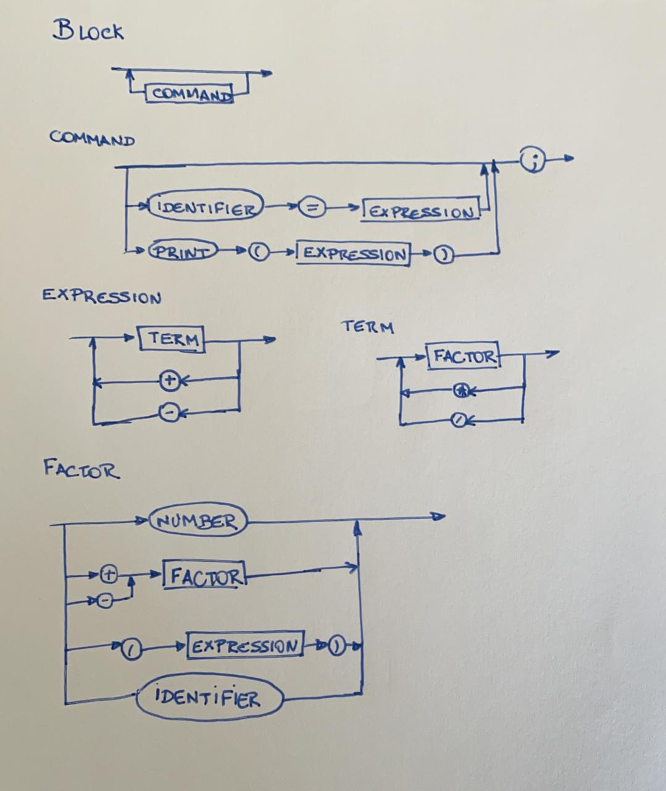

# Projeto Compilador

## Lógica da Computação, 7°Semestre, INSPER 2021.1

## v2.1.0

### Diagrama Sintático   

<p align="center">
    
</p>

### EBNF

<p align="center">
    
</p>

```
BLOCK = { COMMAND } ;
COMMAND = ( λ | ASSIGNMENT | PRINT), ";" ;
ASSIGNMENT = IDENTIFIER, "=", EXPRESSION ;
PRINT = "println", "(", EXPRESSION, ")" ;
EXPRESSION = TERM, { ("+" | "-"), TERM } ;
TERM = FACTOR, { ("*" | "/"), FACTOR } ;
FACTOR = (("+" | "-"), FACTOR) | NUMBER | "(", EXPRESSION, ")" | IDENTIFIER ;
IDENTIFIER = LETTER, { LETTER | DIGIT | "_" } ;
NUMBER = DIGIT, { DIGIT } ;
LETTER = ( a | ... | z | A | ... | Z ) ;
DIGIT = ( 1 | 2 | 3 | 4 | 5 | 6 | 7 | 8 | 9 | 0 ) ;
```
