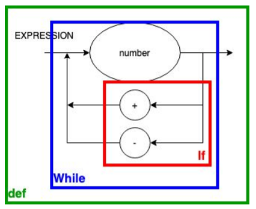

# Projeto Compilador

## Lógica da Computação, 7°Semestre, INSPER 2021.1

## v1.1.X

```python main.py '1+2'``` 

```python main.py '789 +345 - 123'```

```python main.py '4/2+3'```

```python main.py '2 + 3 * 5'```

```python main.py '2 + 3 * 3 /*aaaaaaaaaaa*/+ 4'```

```python main.py '2 + 3 * 3 /*aaaaaaaaaaa*/*/+ 4'```

### Diagrama Sintático   

<p align="center">
    
</p>

### EBNF

<p align="center">
    
</p>

```EXPRESSION = NUMBER, {("+" | "-" | "*" | "/"), NUMBER}, COMMENT ;```

```COMMENT = [(/*), CHARACTER, {CHARACTER} , (*/)] ;```

```NUMBER = DIGIT, {DIGIT} ;```

```DIGIT = "0" | "1" | "2" | "3" | "4" | "5" | "6" | "7" | "8" | "9" ;```

```LOWER = "a" | "b" | "c" | "d" | "e" | "f" | "g" | "h" | "i" | "j" | "k" | "l"  |"m "| "n" | "o" | "p" | "q" | "r" | "s" | "t" | "u" | "v" | "w" | "x" | "y" | "z" ;```

```UPPER = "A" | "B" | "C" | "D" | "E" | "F" | "G" | "H" | "I" | "J" | "K" | "L" | "M" | "N" | "O" | "P" | "Q" | "R" | "S" | "T" | "U" | "V" | "W" | "X" | "Y" | "Z" ;```

```SPECIAL =  "-" | " " | """ | "#" | "&" | "’" | "(" | ")" | "*" | "+" | "," | "." | "/" | ":" | ";" | "<" | "=" | ">" ;```

```CHARACTER ⇐ LOWER | UPPER | DIGIT | SPECIAL```


