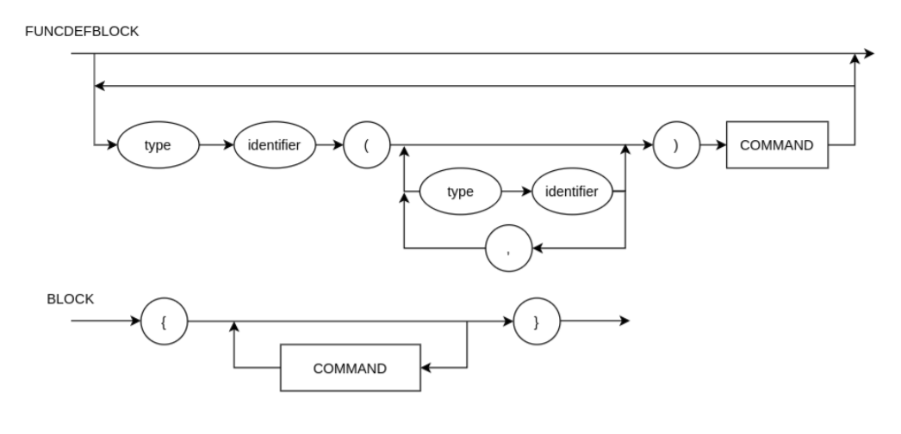
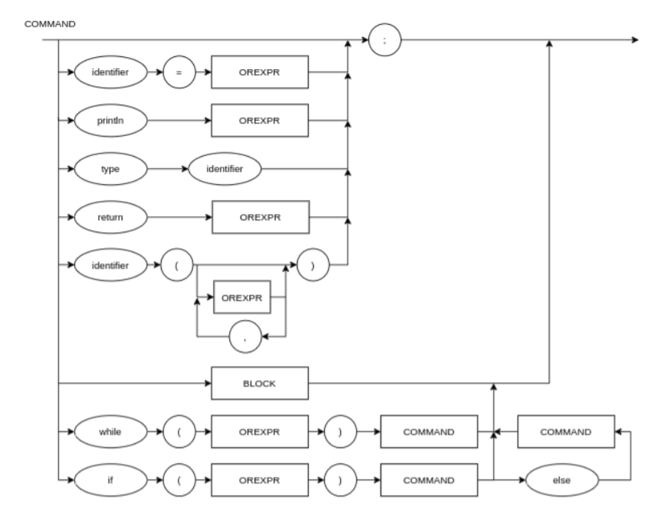
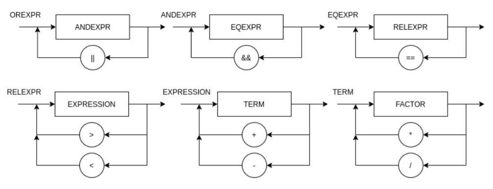
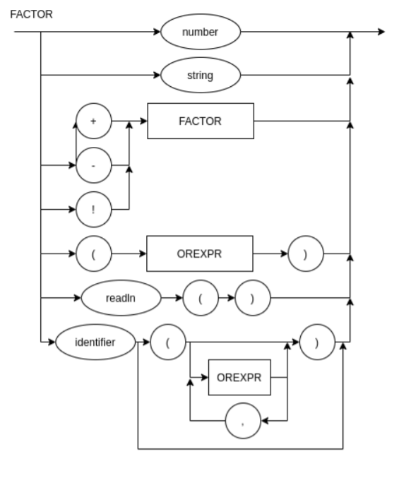

# Projeto Compilador

## Lógica da Computação, 7°Semestre, INSPER 2021.1

## Status:


## v2.3

### Diagrama Sintático   

<p align="center">
    
</p>

<p align="center">
    
</p>

<p align="center">
    
</p>

<p align="center">
    
</p>

### EBNF

```
FUNCDEFBLOCK { TYPE, IDENTIFIER, "(", ARGS, ")", COMMAND } ;
ARGS = λ | TYPE, IDENTIFIER { ",", TYPE, IDENTIFIER } ;
BLOCK = "{", { COMMAND, } "}" ;
COMMAND = ( λ | ASSIGNMENT | PRINT | READ), ";" | BLOCK | WHILESTMT | IFSMT | DECLARE | FUNCCALL ;
ASSIGNMENT = IDENTIFIER, "=", OREXPR ;
PRINT = "println", "(", OREXPR, ")" ;
READ = "readln", "(", ")" ;
DECLARE = TYPE, IDENTIFIER, ";" ;

FUNCCALL = IDENTIFIER, "(", FUNCCALLARGS, ")", ";" ;

FUNCCALLARGS = λ | OREXPR { ",", OREXPR } ;

TYPE = ( "int" | "strign" | "bool" ) ;


IFSTMT = "if", "(", OREXPR, ")", COMMAND ["else", COMMAND] ;
WHILESTMT = "while", "(", OREXPR, ")", COMMAND ;

OREXPR = ANDEXPR ["||", ANDEXPR] ;
ANDEXPR = EQEXPR ["&&", EQEXPR] ;
EQEXPR = RELEXPR ["==", EQEXPR] ;
RELEXPR = EXPRESSION [(">" | "<"), EXPRESSION] ;

EXPRESSION = TERM, { ("+" | "-"), TERM } ;
TERM = FACTOR, { ("*" | "/"), FACTOR } ;
FACTOR = (("+" | "-"| "!"), FACTOR) | NUMBER | "(", OREXPR, ")" | READ | STRING | IDENTIFIER | FUNCCALLARGS ;
IDENTIFIER = LETTER, { LETTER | DIGIT | "_" } ;
NUMBER = DIGIT, { DIGIT } ;
LETTER = ( a | ... | z | A | ... | Z ) ;
DIGIT = ( 1 | 2 | 3 | 4 | 5 | 6 | 7 | 8 | 9 | 0 ) ;
STRING = QUOT_MARK, {(DIGIT | LETTER | SPECIAL_CHARACTERS)}, QUOT_MARK ;
QUOT_MARK = '"' ;
```
